# PipeDream — Design Document

## 1. Overview

PipeDream (pipeline_composer) is a security-hardened orchestrator for **unidirectional data processing pipelines** on RHEL-based Linux systems. It chains arbitrary executables together via named FIFOs, enforcing strict forward-only data flow through 12 independent security layers: DAC, SELinux MAC, seccomp-bpf, Linux namespaces, cgroups v2, HMAC signing, systemd hardening, binary integrity verification, supervisor privilege separation, stderr isolation, FD isolation, and required-files isolation.

Designed for **Cross Domain Solutions** and sensitive data processing where information must flow strictly forward through pipeline stages with no possibility of backward flow.

---

## 2. High-Level Architecture

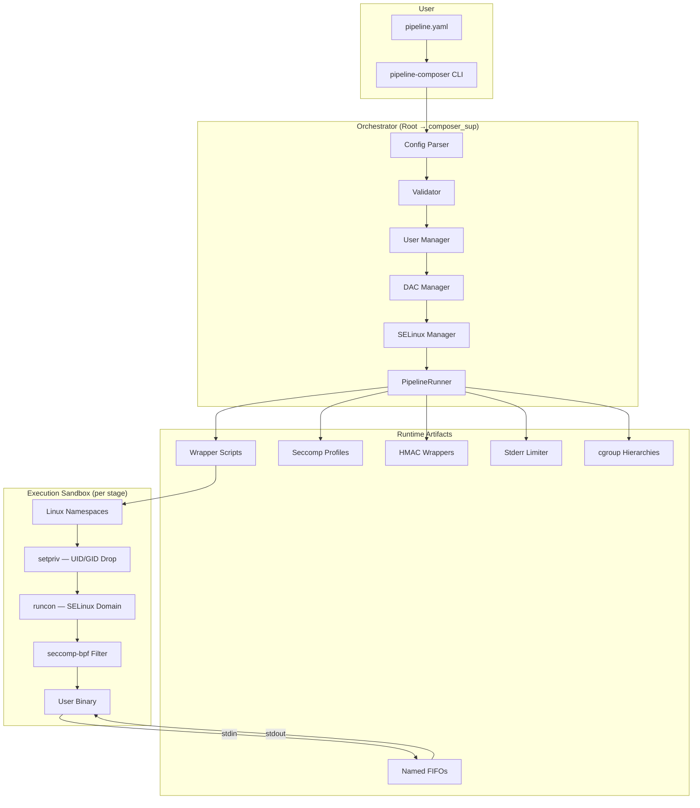

---

## 3. CLI Command Flow

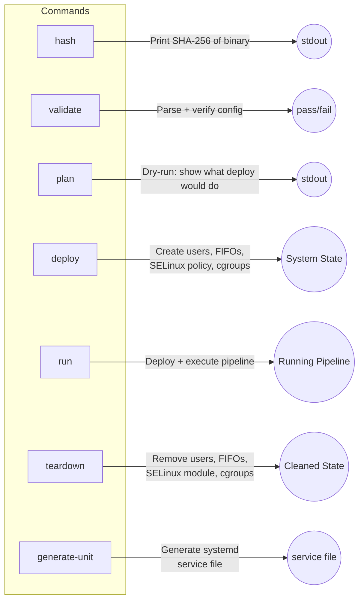

---

## 4. Pipeline Data Flow

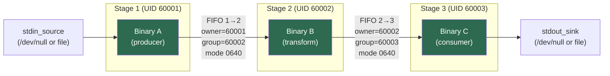

### With HMAC Signing Enabled

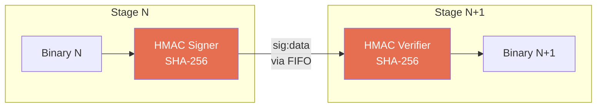

---

## 5. Setup & Deployment Sequence

```mermaid
sequenceDiagram
    actor User
    participant CLI as pipeline-composer
    participant OS as Linux Kernel / Subsystems
    participant SEL as SELinux

    User->>CLI: run pipeline.yaml

    rect rgb(40, 40, 60)
        Note over CLI: Phase 1 — Parse & Validate (as root)
        CLI->>CLI: parse_config(YAML)
        CLI->>CLI: validate_pipeline()
        CLI->>OS: sha256sum each binary
        OS-->>CLI: hash match ✓
    end

    rect rgb(40, 60, 40)
        Note over CLI: Phase 2 — System Setup (as root)
        CLI->>OS: useradd per-composable UIDs (60000+)
        CLI->>OS: mkfifo + chown + chmod 0640
        CLI->>OS: setfacl for required_files
        CLI->>SEL: generate_policy.sh → TE + FC + IF
        CLI->>SEL: checkmodule (compile + neverallow check)
        CLI->>SEL: semodule -i (load policy)
        CLI->>SEL: restorecon (label FIFOs, binaries, logs)
    end

    rect rgb(60, 40, 40)
        Note over CLI: Phase 3 — Generate Runtime Artifacts
        CLI->>CLI: seccomp profiles (OCI JSON)
        CLI->>CLI: seccomp loader (Python BPF)
        CLI->>CLI: HMAC sign/verify scripts
        CLI->>CLI: stderr rate limiter
        CLI->>CLI: per-stage wrapper scripts
    end

    rect rgb(60, 60, 40)
        Note over CLI: Phase 4 — Launch Pipeline
        loop For each composable
            CLI->>OS: setup cgroup (cpu, mem, pids)
            CLI->>OS: Popen(bash wrapper_script.sh)
        end
        CLI->>OS: drop privileges → composer_sup
    end

    Note over CLI: Phase 5 — Monitor & Cleanup
    CLI->>OS: wait() on all children
    CLI->>OS: remove FIFOs, cgroups, work dir
```

---

## 6. Per-Stage Wrapper Execution

Each composable runs inside a wrapper script that applies all isolation layers:

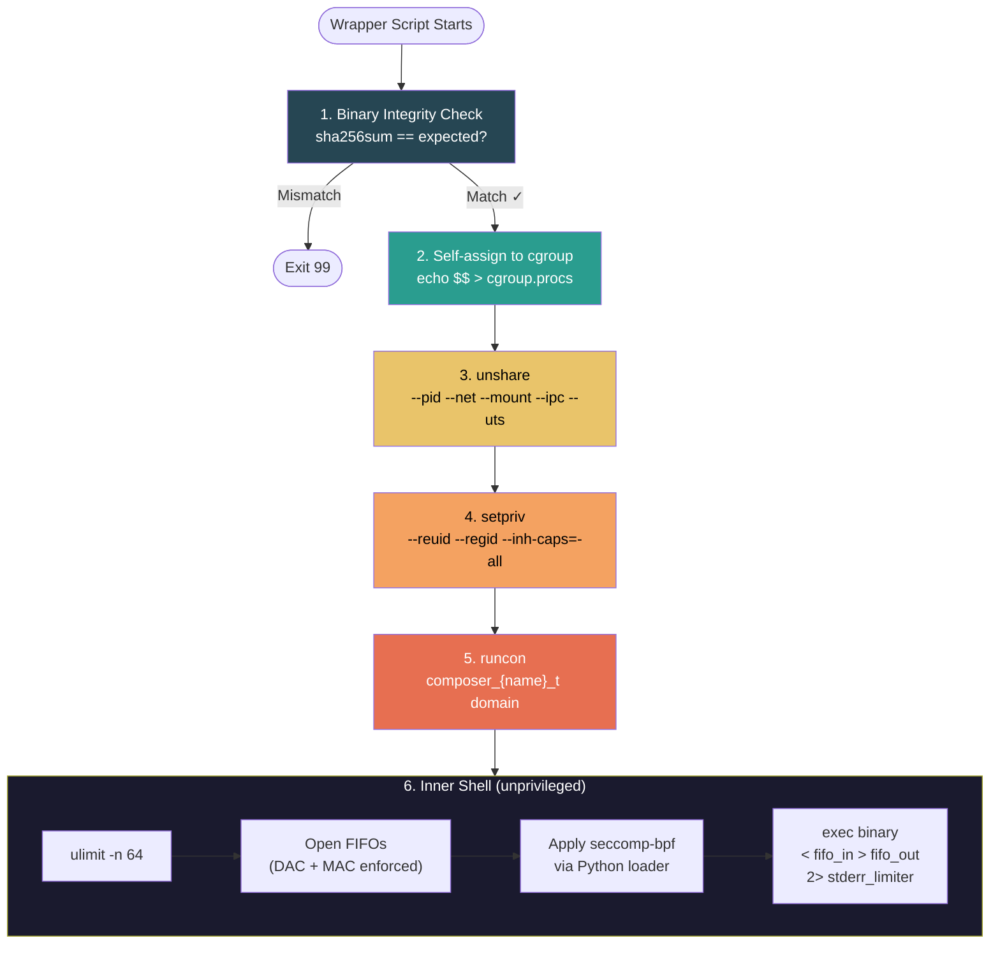

---

## 7. Security Architecture — 12 Isolation Layers

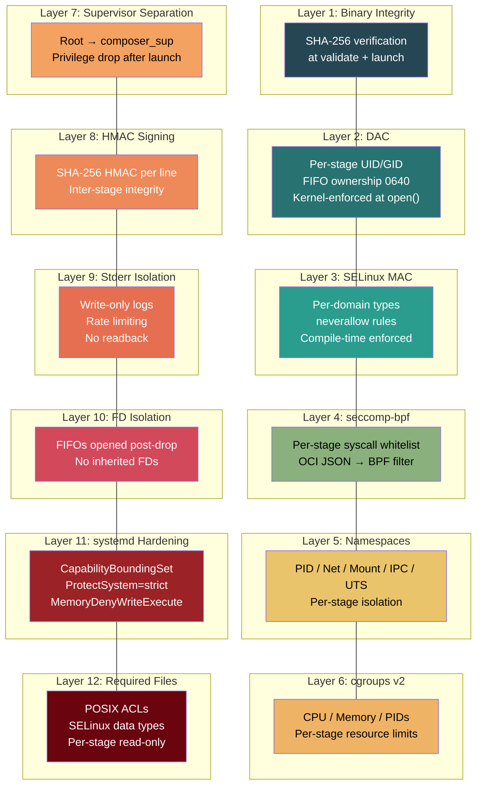

---

## 8. SELinux Policy Structure

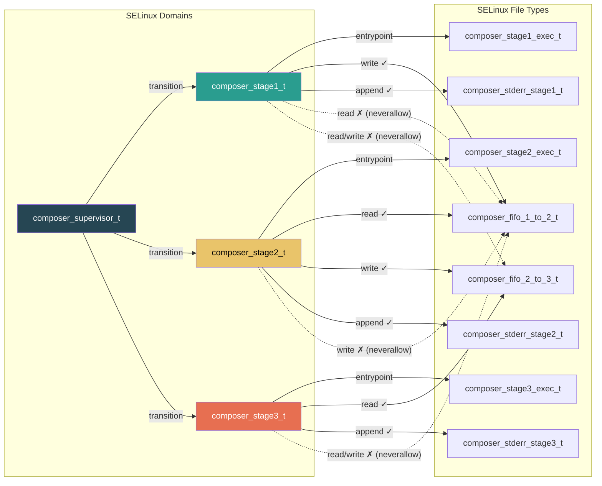

### neverallow Rules (Compile-Time Enforced)

| Rule | Prevents |
|------|----------|
| No loopback reads | Stage cannot read its own output FIFO |
| No reverse flow | Stage cannot write to its input FIFO |
| No non-adjacent access | Stage cannot touch FIFOs it isn't connected to |
| No cross-stage exec | Stage cannot execute another stage's binary |
| No cross-stage data | Stage cannot read another stage's required_files |
| No stderr readback | Write-only log files per stage |
| No inter-stage signals | Stage cannot signal another stage's domain |

---

## 9. Configuration Data Model

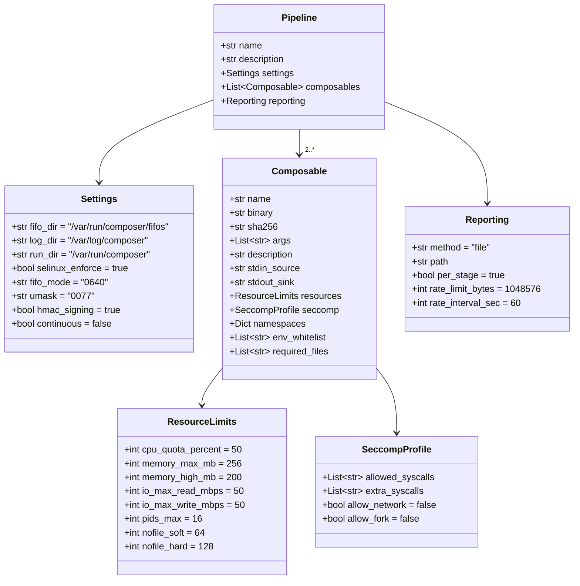

---

## 10. File System Layout

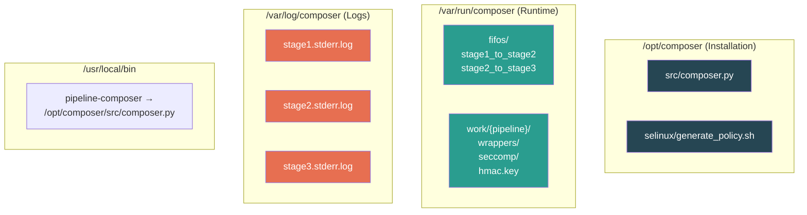

---

## 11. Unidirectionality Enforcement — Three Independent Levels

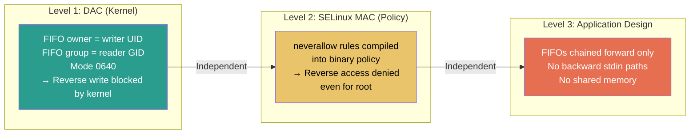

Each level enforces unidirectionality **independently** — compromising one layer does not affect the others.

---

## 12. Multi-Host Deployment

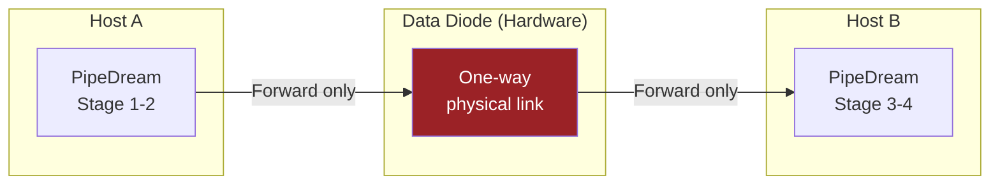

For the highest assurance, stages can span physical hosts connected by a hardware data diode, with PipeDream enforcing software-level unidirectionality on each host independently.
